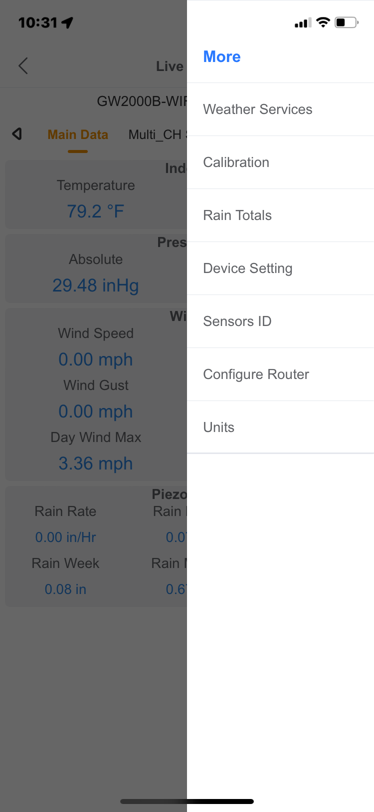
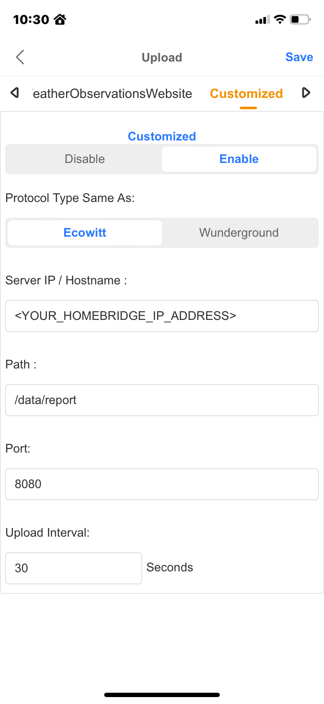
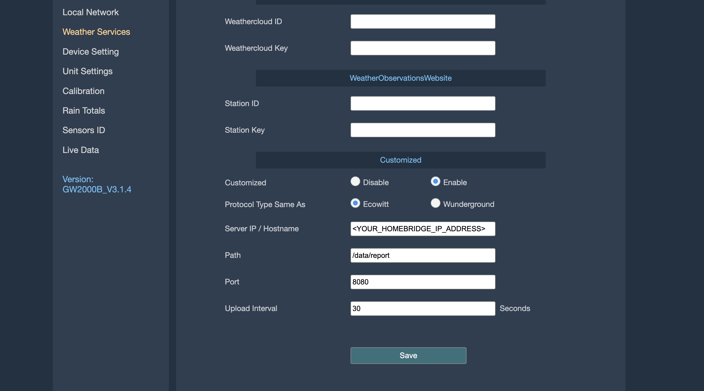

# Homebridge Ecowitt Weather Sensor Plugin

<span align="center" style="text-align:center">
<div align="center" style="text-align:center">


</div>
</span>

## Complete HomeKit support for [Ecowitt]((https://www.ecowitt.com/)) Weather Stations and Sensors through [Homebridge](https://homebridge.io).

This plugin operates as a service that listens for data reports from an Ecowitt WiFi Gateway or Weather Display Console.  The Ecowitt gateway or console must be configured to publish weather service reports to the Homebridge Ecowitt Weather Sensor plugin.

For bugs, feature requests, and questions - [please file a new issue](https://github.com/rhockenbury/homebridge-ecowitt-weather-sensors/issues/new/choose).

## Features
* Support for a wide range of sensor types
* Operates locally without the need for any cloud services
* Sensors can be hidden via the plugin settings
* Configurable units for display, and for setting sensor thresholds

## Requirements
* GW2000 Gateway, GW1000 Gateway, or HP2551 Weather Display Console

## Installation

#### Option 1: Install via Homebridge UI (recommended):

Search for "Ecowitt" on the Homebridge UI "Plugins" tab, and select install.

#### Option 2: Install manually:

```
sudo npm install -g homebridge-ecowitt
```

## Plugin Configuration
<a name="pookie"></a>

It is recommended to configure the plugin via the **Settings** UI.

The plugin's **Base Station** settings must be configured before configuring the Ecowitt gateway or display console.

### MAC Address

This can be found on the *About* screen on the Weather Display Console, or via the **WSView Plus** app on the "My Devices" tab.

The **WSView Plus** can be found on the [Apple App Store](https://apps.apple.com/us/app/wsview-plus/id1581353359) or the [Google Play Store](https://play.google.com/store/apps/details?id=com.ost.wsautool).

The MAC address is used validate that the data report received is coming from the correct gateway or display console.

### Data Report Service

The **Port** and **Path** settings configure on which port and path the data report service will listen for data reports coming from the gateway or display console.

Default settings are `8080` for the port and `/data/report` for the path. Other values may be used as desired. Depending on your system or network configuration ensure the **Port** selected is not already in use and that its accessible from the Ecowitt base station.

### Gateway / Display Console Configuration

After configuring the **Base Station** settings, restart Homebridge and confirm via the status logs that there are no errors and that the data report service has been started and is listening.

Before updating the gateway or display console to report its data to the plugin, ensure all the available sensors have been configured and are correctly reporting their data.

The plugin requires the custom weather service to be configured to report data with **Path** and **Port** parameters that match the same in the **Base Station** settings.

The service **Protocol Type** must be configured as **Ecowitt**. The **Upload Interval** can be configured as desired. Anywhere from 20 seconds to 60 seconds is recommended as the data report messages are relatively small and do not put much load on the network or Homebridge host.

The gateway or display console can be configured using the Ecowitt **WSView Plus** app. In the app, select gateway or display console under "My Devices" then navigate to "More" on the upper right to select "Weather Services."

<span align="center" style="text-align:center">
<div align="center" style="text-align:center">

   

</div>
</span>

The gateway and display console can also be configured directly via its web UI on the "Weather Services" tab.

<span align="center" style="text-align:center">
<div align="center" style="text-align:center">




</div>
</span>

It is also recommended to configure the Homebridge host system with a static IP address (or DHCP reservation) to avoid issues with Homebridge IP address changing after system reboots.

After the gateway or display console has been configuration has been updated, sensor data reports will appear in the Homebridge status log. The plugin will automatically configure the accessories based on the first data report received.


## Supported Devices

The full list of all [Ecowitt sensors](https://shop.ecowitt.com/collections/wifi-sensor) and [Ecowitt consoles](https://shop.ecowitt.com/collections/console) can be found on the [Ecowitt online store](https://shop.ecowitt.com/).

This plugin currently supports the Ecowitt devices shown in the table below. If your Ecowitt device is currently not supported, [please open a feature request](https://github.com/rhockenbury/homebridge-ecowitt/issues/new?assignees=&labels=enhancement&projects=&template=feature-request.md&title=).

| Device | Description | Product Image |
| -------- | ------- | ------- |
| GW1000 |
| GW1100 |
| GW2000 |
| HP2551 | Weather Station Display Console |
| WH24 | Solar Powered 7-in-1 Outdoor Sensor |
| WH31 | Multi-Channel Temperature and Humidity Sensor | |
| WH32 |
| WH40 | Self-Emptying Rain Collector Rainfall Sensor |  |
| WH41 | PM2.5 Air Quality Sensor Monitor Outdoor |  |
| WH51 | Wireless Soil Moisture Sensor |  |
| WH55 | Wireless Water Leak Detection Sensor with Loud Audio Alarm|  |
| WH57 | Wireless Lightning Detection Sensor |  |


* GW1000 & GW2000 - WiFi Weather Station Gateway with Indoor Temperature, Humidity and Barometric Sensor
* HP2551 - Weather Station Display Console
* WH24 - Solar Powered 7-in-1 Outdoor Sensor
* WH31 - Multi-Channel Temperature and humidity Sensor
* WH32 - Indoor Temperature, Humidity and Barometric Sensor
* WH41 - PM2.5 Air Quality Sensor Monitor Outdoor
* WH51 - Wireless Soil Moisture Sensor
* WH55 - Wireless Water Leak Detection Sensor with Loud Audio Alarm
* WH57 - Wireless Lightning Detection Sensor
* WH65 - Solar Powered 7-in-1 Outdoor Sensor
* WN34 - Multi-Channel Temperature Sensor


// add table for config Options

// add note about custom characteristics -> viewing custom characteristics


## Sensor Notes


### Outdoor Weather Sensors
#### Wind
* Sensors (Can be individually hidden via the plugin settings)
    * Direction
    * Speed
    * Gust
    * Maximum Daily Gust
* Presented as **Motion Sensors**
  * **Motion Detected** status is triggered based on thresholds configured in the plugin settings
* Wind direction units are in degrees
* Wind speed units can be configured in the plugin setting (kts, mps, mph, kmh)
* Wind speed thresholds are specified using the configured (selected) units

#### Rain
* Sensors (Can be individually hidden via the plugin settings)
  * Rate
  * Event
  * Hourly
  * Daily
  * Weekly
  * Monthly
  * Yearly
* Presented as **Leak Sensors**
  * For the Rate sensor, the **Leak Detected** status is based on the threshold configured in the plugin settings.
  * For all other sensors the **Leak Detected** status is triggered if the sensor's value is non-zero
* Rain display units and detection thresholds are configured the plugin settings

#### UV Index
* Can be hidden via plugin settings
* Presented as an **Occupancy Sensor**
  * **Occupancy Detected** status is based on the threshold configured in the plugin settings

#### Solar Radiation
* Can be hidden via plugin settings
* Presented as a **Light Sensor**
* Display units and conversion factor to lux are configured in plugin settings


### Indoor Thermometer/Hygrometer/Barometer Sensor
* Can be hidden via plugin settings

### Multi-Channel Thermometer/Hygrometer Sensors
* Can be hidden via plugin settings
* Up to 8 sensors supported
* Sensors can be individually named via the plugin settings

### Multi-Channel Thermometer Sensors
* Can be hidden via plugin settings
* Up to 8 sensors supported
* Sensors can be individually named via the plugin settings

### Lightning Detection Sensor
* Can be hidden via plugin settings
* Number of lighing events is presented as a **Contact Sensor**
  * **Open** state when number of events is > 0
  * **Closed** state when number of events is 0
* Distance and time presented as an **Occupancy Sensor**
  * **Occupancy Detected** status is set when number of events is > 0
* Distance units configured via plugin settings

### Soil Moisture Sensors
* Can be hidden via plugin settings
* Up to 8 sensors supported
* Sensors can be individually named via the plugin settings
* Presented as **Humidity Sensors**

### Leak Detection Sensors
* Can be hidden via plugin settings
* Up to 4 sensors supported
* Sensors can be individually named via the plugin settings

### PM2.5 Air Quality Sensors
* Can be hidden via plugin settings
* Up to 4 sensors supported
* Sensors can be individually named via the plugin settings
* Current and 24H Average presented as separate sensors


## Frequently Asked Questions

### How do I migrate to this plugin from other Homebridge Ecowitt plugins?
> This plugin includes most prior version of Homebridge Ecowitt plugin forks including v1.0 and v1.1 from [spatialdude](https://github.com/spatialdude), v1.2 and v1.3 from [ochong](https://github.com/ochong) and v1.4 from [pavelserbajlo](https://github.com/pavelserbajlo). If you are currently using these mentioned versions, you can switch to the equivalent version of this plugin and get the exact functionality.

> However, I would also recommend updating to the latest version of this plugin to take advantage of the latest features.  To migrate from any version below v2.0 to v2.0 or higher, you should clear the Homebridge accessory cache for all Ecowitt sensors, install the latest plugin version, and then restart Homebridge.

### Does this plugin support devices produced by other manufacturers?
> There are a number of weather station distributors that re-package and re-brand the hardware sensors from [Fine Offset](https://www.foshk.com/Wifi_Weather_Station/). Along with Ecowitt, other notable distributors include Aercus, Ambient Weather, and Frogger.  These brands typically also use similar firmware / software within their ecosystem, and many provide the ability to publish weather data reports to a custom endpoint.  If the weather station brand you are using relies on [Fine Offset](https://www.foshk.com/Wifi_Weather_Station/) hardware, and can publish custom/local weather reports, please [file a feature request](https://github.com/rhockenbury/homebridge-ecowitt/issues/new?assignees=&labels=enhancement&projects=&template=feature-request.md&title=) to let me know what support you would like to see.

### I use an Ecowitt sensor that's not currently supported.  What can I do to get it supported?
> Please [open a feature request](https://github.com/rhockenbury/homebridge-ecowitt/issues/new?assignees=&labels=enhancement&projects=&template=feature-request.md&title=) on the Github project to let me know what support is needed.
