<span align="center" style="text-align:center">
<div align="center" style="text-align:center">

        

# Homebridge Ecowitt Weather Sensors

<!-- badges -->

[](https://github.com/rhockenbury/homebridge-ecowitt-weather-sensors/actions/workflows/build-master.yml) [](https://www.npmjs.com/package/homebridge-ecowitt-weather-sensors) [](https://www.npmjs.com/package/homebridge-ecowitt-weather-sensors) [](https://opensource.org/licenses/Apache-2.0)

</div>
</span>

## Complete HomeKit support for [Ecowitt](https://www.ecowitt.com)) Weather Sensors with [Homebridge](https://homebridge.io).

This plugin operates as a service that listens for data reports from an Ecowitt WiFi Gateway or Weather Display Console.  The Ecowitt gateway or console must be configured to publish weather service reports to the Homebridge Ecowitt Weather Sensors plugin.

For bugs, feature requests, and questions - [please file a new issue](https://github.com/rhockenbury/homebridge-ecowitt-weather-sensors/issues/new/choose).

## Features

* Stable support for most Ecowitt weather sensor products
* Operates locally without the need for any cloud services
* Detection thresholds for most weather sensor devices to drive automations
* Customize units, sensor override names, and whether to show or hide a device

> :warning: **This plugin uses a few custom characteristics on HomeKit services which are not visible on the HomeKit app. For full functionality, third-party apps such as [Eve](https://www.evehome.com/en-us/eve-app), [Controller for HomeKit](https://controllerforhomekit.com/) or [Home+](https://apps.apple.com/us/app/home-6/id995994352) are recommended, but not required.**

## Requirements

* GW2000 Gateway, GW1100 Gateway, GW1000 Gateway, or HP2551 Weather Display Console
* **WSView Plus** app is recommended, available through the [Apple App Store](https://apps.apple.com/us/app/wsview-plus/id1581353359) or the [Google Play Store](https://play.google.com/store/apps/details?id=com.ost.wsautool).

## Installation

Search for "Ecowitt" on the [Homebridge Config UI X](https://github.com/homebridge/homebridge-config-ui-x) Plugins screen, find `homebridge-ecowitt-weather-sensors` and select to install.

## Getting Started

It is recommended to configure the plugin via the **Settings** UI.

The plugin's **Base Station** settings must be configured before configuring the Ecowitt gateway or display console.

### MAC Address

This can be found on the *About* screen on the Weather Display Console, or via the **WSView Plus** app on the "My Devices" tab.

The MAC address is used validate that the data report received is coming from the correct gateway or display console.

### Data Report Service

The **Port** and **Path** settings configure on which port and path the data report service will listen for data reports coming from the gateway or display console.

Default settings are `8080` for the port and `/data/report` for the path. Other values may be used as desired. Depending on your system or network configuration ensure the **Port** selected is not already in use and that its accessible from the Ecowitt base station.

<span align="center" style="text-align:center">
<div align="center" style="text-align:center">

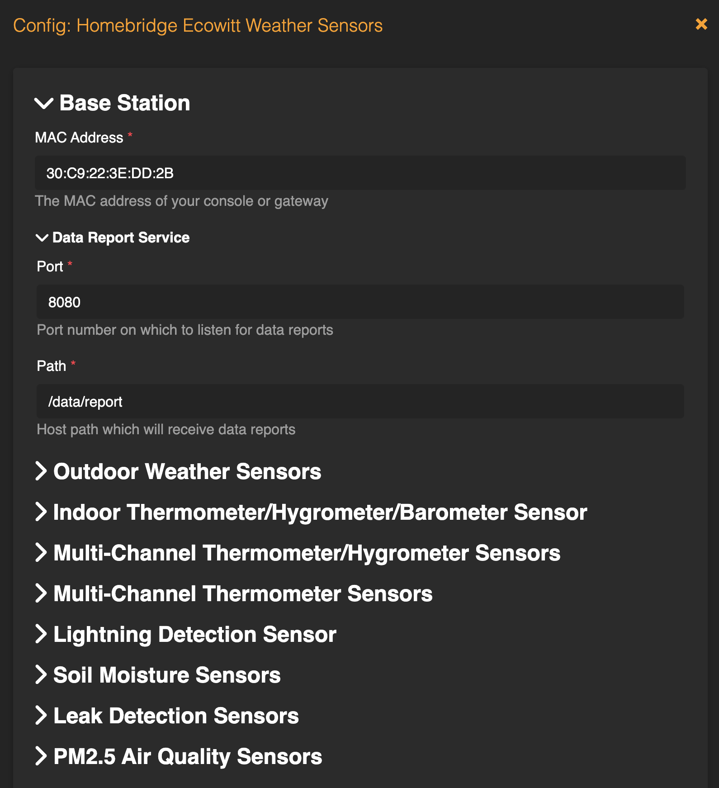

*Plugin UI with Required Configuration Options*

</div>
</span>

### Gateway / Display Console Configuration

After configuring the **Base Station** settings, restart Homebridge and confirm via the status logs that there are no errors and that the data report service has been started and is listening.

Before updating the gateway or display console to report its data to the plugin, ensure all the available sensors have been configured and are correctly reporting their data.

The plugin requires the custom weather service to be configured to report data with **Path** and **Port** parameters that match the same in the **Base Station** settings.

The service **Protocol Type** must be configured as **Ecowitt**. The **Upload Interval** can be configured as desired. Anywhere from 20 seconds to 60 seconds is recommended as the data report messages are relatively small and do not put much load on the network or Homebridge host.

The gateway or display console can be configured using the Ecowitt **WSView Plus** app. In the app, select gateway or display console under "My Devices" then navigate to "More" on the upper right to select "Weather Services."

<span align="center" style="text-align:center">
<div align="center" style="text-align:center">

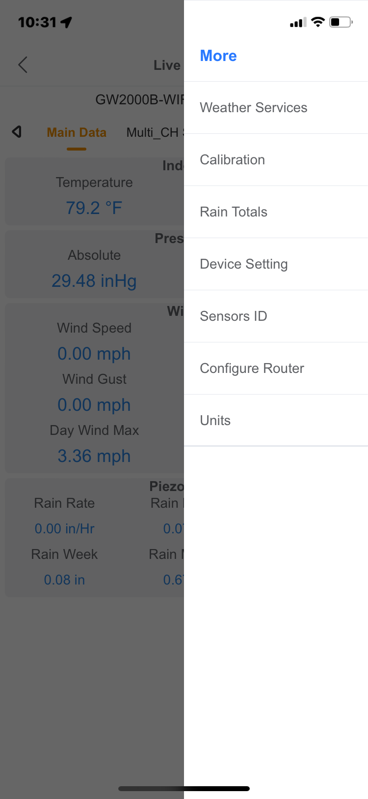   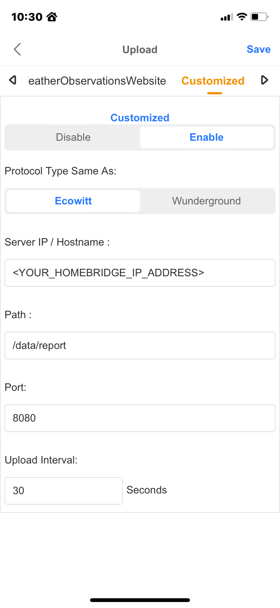

*Ecowitt WSView Plus app showing Custom Weather Service*

</div>
</span>

The gateway and display console can also be configured directly via its web UI on the "Weather Services" tab.

<span align="center" style="text-align:center">
<div align="center" style="text-align:center">

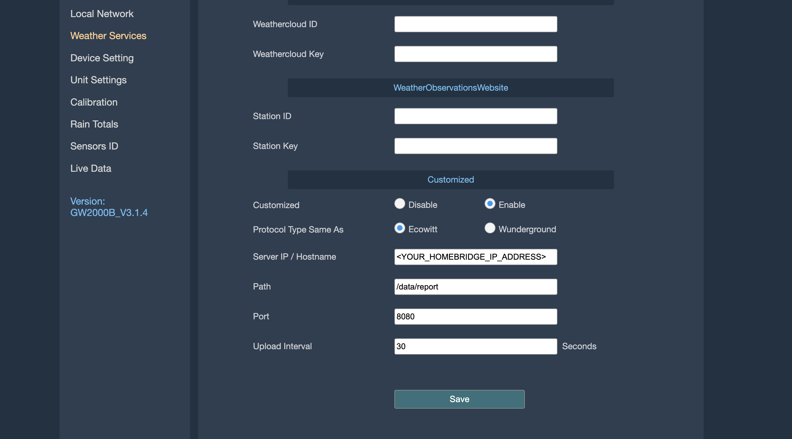

*Ecowitt Gateway Web UI showing Custom Weather Service*

</div>
</span>

It is also recommended to configure the Homebridge host system with a static IP address (or DHCP reservation) to avoid issues with Homebridge IP address changing after system reboots.

After the gateway or display console has been configuration has been updated, sensor data reports will appear in the Homebridge status log. The plugin will automatically configure the accessories based on the first data report received.

## Supported Devices

The full list of all [Ecowitt sensors](https://shop.ecowitt.com/collections/wifi-sensor) and [Ecowitt consoles](https://shop.ecowitt.com/collections/console) can be found on the [Ecowitt online store](https://shop.ecowitt.com/).

This plugin currently supports the Ecowitt devices shown in the table below. If your Ecowitt device is currently not supported, [please open a feature request](https://github.com/rhockenbury/homebridge-ecowitt/issues/new?assignees=\&labels=enhancement\&projects=\&template=feature-request.md\&title=).

| Device | Description | Service Types| Product Image |
| -------- | ------- | ------- | ------ |
| GW1000 / GW1100 | WiFi Weather Station Gateway | <ul><li>Temperature</li><li>Humdity</li></ul> | 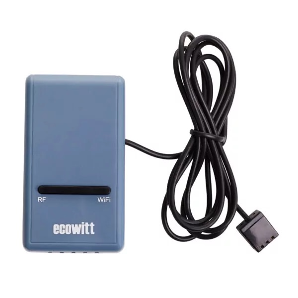 |
| GW2000 | WiFi Weather Station Gateway | <ul><li>Temperature</li><li>Humdity</li></ul> | 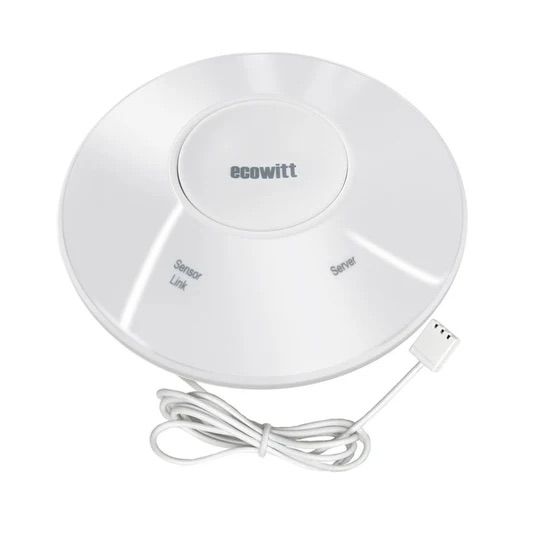 |
| HP2550 | 7" TFT Color Display Weather Console | 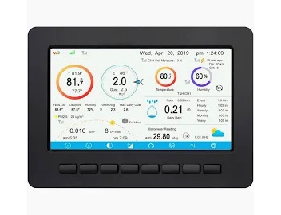 |
| WH25 | Indoor Temperature, Humidity and Barometric Sensor | <ul><li>Temperature</li><li>Humdity</li></ul> | 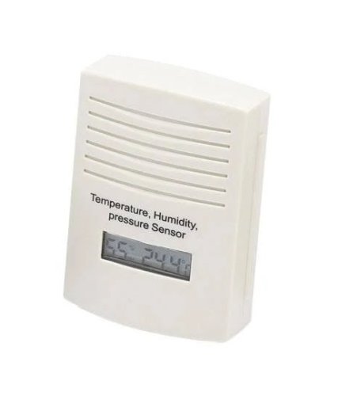 |
| WH31 | Multi-Channel Temperature and Humidity Sensor | <ul><li>Temperature</li><li>Humdity</li></ul> | 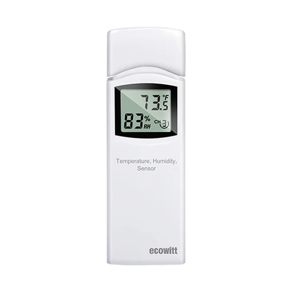 |
| WH40 | Self-Emptying Rain Collector Rainfall Sensor | <ul><li>Rain Rate</li><li>Rain Event</li><li>Rain Hourly</li><li>Rain Daily</li><li>Rain Weekly</li><li>Rain Monthly</li><li>Rain Yearly</li></ul> | 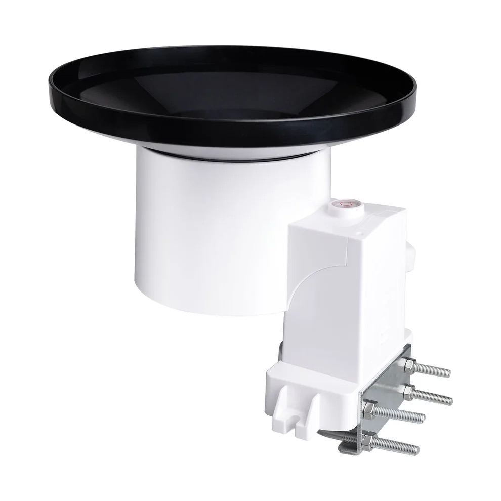 |
| WH41 | PM2.5 Air Quality Sensor Monitor Outdoor | <ul><li>Air Quality</li><li>Air Quality (24hrs)</li></ul> | 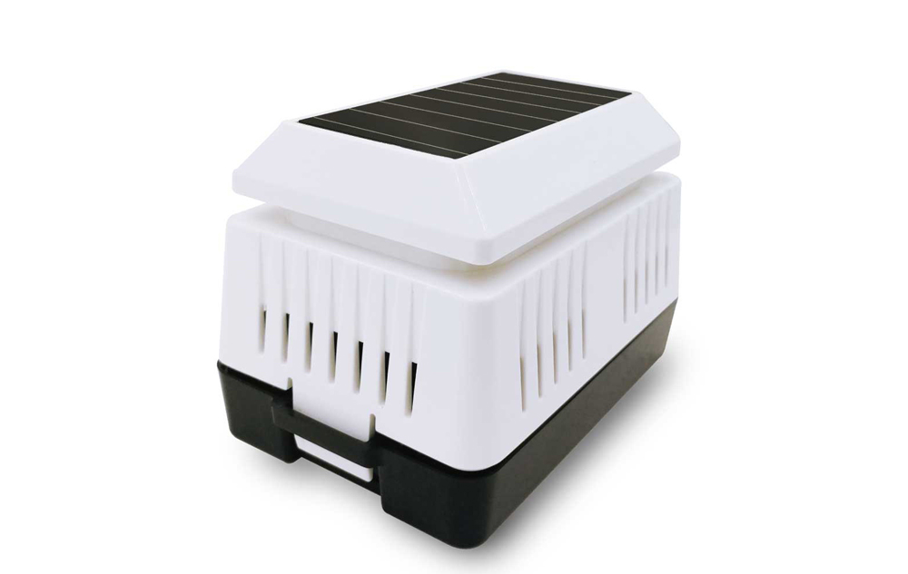 |
| WH51 | Wireless Soil Moisture Sensor | <ul><li>Soil Moisture</li></ul> | 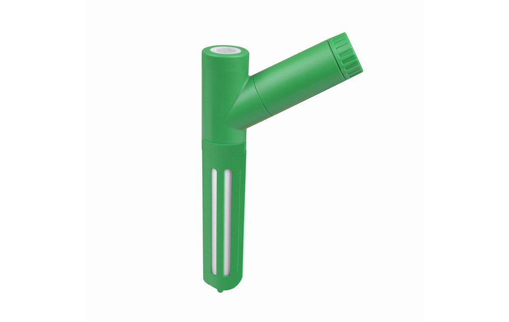 |
| WH55 | Wireless Water Leak Detection Sensor with Loud Audio Alarm | <ul><li>Leak</li></ul> | 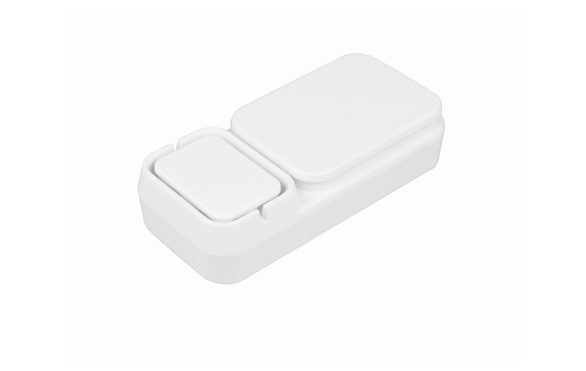 |
| WH57 | Wireless Lightning Detection Sensor | <ul><li>Lightning Event</li><li>Lightning Distance</li></ul> |  |
| WH65 | Solar Powered 7-in-1 Outdoor Station | <ul><li>Temperature</li><li>Humidity</li><li>Solar Radiation</li><li>UV Index</li><li>Dew Point</li><li>Wind Direction</li><li>Wind Speed</li><li>Wind Gust</li><li>Wind Speed Daily Max</li><li>Rain Rate</li><li>Rain Event</li><li>Rain Hourly</li><li>Rain Daily</li><li>Rain Weekly</li><li>Rain Monthly</li><li>Rain Yearly</li></ul> | 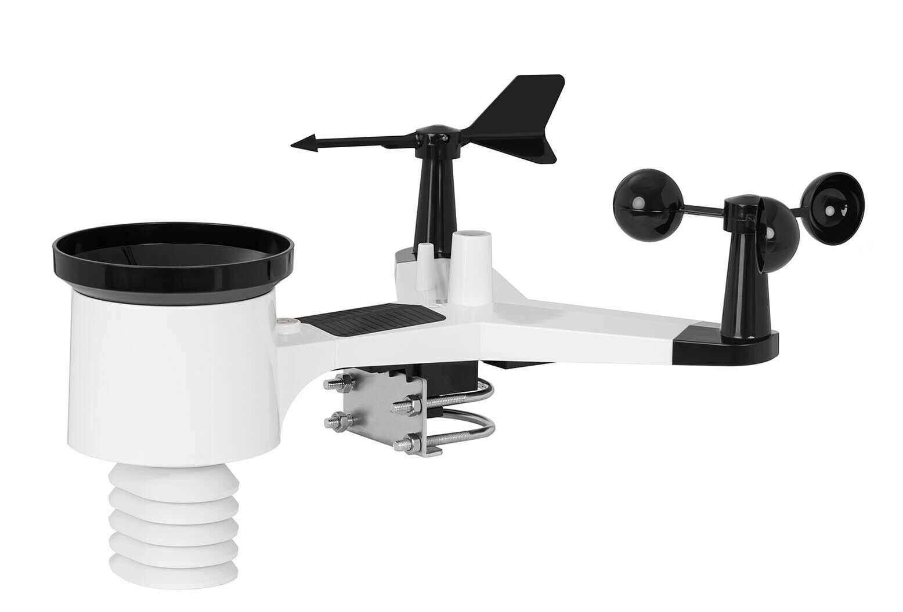 |
| WN34 | Multi-Channel Temperature Sensor | <ul><li>Temperature</li></ul>  | 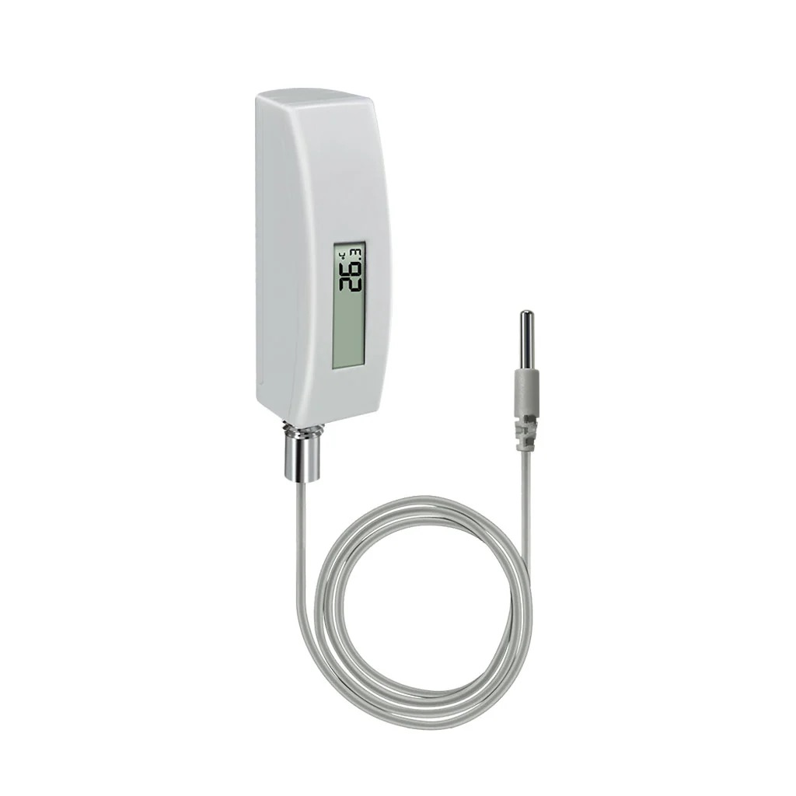 |
| WS85 | 3-in-1 Solar Weather Station | <ul><li>Wind Direction</li><li>Wind Speed</li><li>Wind Gust</li><li>Wind Speed Daily Max</li><li>Rain Rate</li><li>Rain Event</li><li>Rain Hourly</li><li>Rain Daily</li><li>Rain Weekly</li><li>Rain Monthly</li><li>Rain Yearly</li></ul> | 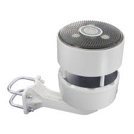 |

> :warning: **This plugin does not currently implement barometric (pressure) services.  While these are not supported natively by HomeKit as this time, they are planned to be implemented with custom characteristics, see [this issue](https://github.com/rhockenbury/homebridge-ecowitt-weather-sensors/issues/5).**

## Configuration

### Basic Configuration

This plugin will work with the basic configuration described in [Getting Started](https://github.com/rhockenbury/homebridge-ecowitt-weather-sensors/tree/master?tab=readme-ov-file#getting-started). As an example -

```
{
    "platform": "Ecowitt",
    "mac": "30:C9:22:3E:DD:2B",
    "port": 8080,
    "path": "/data/report"
}
```

### Optional Configuration

It's recommended to configure these through the Plugin Config UI.

| Option | Default | Explanation |
| -------- | ------- | ------- |
| unregister | `false` | Remove all existing accessories during next plugin startup. Restart Homebridge after setting to `true`, and then **set it back to `false` to avoid unregistering again** |
| staticNames | `false` | Set to `true` to not show the weather metric value in the service names of the accessory so that the service names do not change. **Currently only fully supported on the Wind and Rain sensors.** TODO - screenshots, note about automation |
| ws.hide | `false` | Whether to show or hide the full weather station accessory. |
| ws.uv.hide | `false` | Whether to show or hide the UV Index information on the weather station accessory. |
| ws.uv.threshold | `6` | Threshold to trigger the UV Index Occupancy sensor. <br/><br/><b><u>UV Levels</u></b><br/>0-2: Low<br/>3-5: Moderate<br/>6-7: High<br/>8-10: Very High<br/>11+: Extreme</p> |
| ws.solarradiation.hide | `false` | Whether to show or hide the solar radiation information on the weather station accessory. |
| ws.solarradiation.luxFactor | `126.7` | Factor to multiple the Solar Radiation data (in W/m<sup>2</sup>) to convert to Lux. |
| ws.wind.hide | `[]` | List of wind information to hide on the weather station accessory. By default, all wind information is shown. Possible values are: <br/><br/>`Direction`<br/>`Speed`<br/>`Gust`<br/>`MaxDailyGust`</p> |
| ws.wind.units | `mph` | The units to display wind speed. Possible values are: <br/><br/>`mph`: Miles per Hour<br/>`kmh`: Kilometers per Hour<br/>`mps`: Meters per Second<br/>`kts`: Knots</p> |
| ws.wind.speedThreshold</br>ws.wind.gustThreshold </br>ws.wind.maxDailyGustThreshold  | None | Thresholds to trigger the Motion Sensor for wind speed, gust speed, and max daily gust specified. By default, thresholds are not set.  Thresholds should be specified in units selected for wind speed. |
| ws.rain.hide | `[]` | List of rain information to hide on the weather station accessory. By default, all rain information is shown. Possible values are: <br/><br/>`Rate`<br/>`Event`<br/>`Hourly`<br/>`Daily`<br/>`Weekly`<br/>`Monthly`<br/>`Yearly`<br/></p> |
| ws.rain.units | `in` | The units to display rain accumulation. Possible values are: <br/><br/>`in`: Inches<br/>`mm`: Millimeters</p> |
| ws.rain.rateThreshold</br>ws.rain.eventThreshold </br>ws.rain.hourlyThreshold </br>ws.rain.dailyThreshold </br>ws.rain.weeklyThreshold </br>ws.rain.monthlyThreshold </br>ws.rain.yearlyThreshold | None | Thresholds to trigger the Motion Sensor for rain rate, event total, hourly total, daily total, weekly total, monthly total and yearly total.  By default, thresholds are not set.  Thresholds should be specified in units selected for rain. |
| thbin.hide | `false` | Whether to show or hide the indoor temperature, humidity and pressure information from the base station. |
| th.hide | `false` | Whether to show or hide the outdoor temperature and humidity (WH31) information. |
| th.name\[1-8] | None | Override names for up to 8 temperature and humidity sensors (WH31) corresponding to channels 1-8. |
| tf.hide | `false` | Whether to show or hide the outdoor temperature (WN34) information. |
| tf.name\[1-8] | None | Override names for up to 8 temperature sensors (WN34) corresponding to channels 1-8. |
| soil.hide | `false` | Whether to show or hide the soil moisture sensor (WH51) information. |
| soil.name\[1-8] | None | Override names for up to 8 soil moisture sensors (WH51) corresponding to channels 1-8. |
| leak.hide | `false` | Whether to show or hide the leak sensor (WH55) information. |
| leak.name\[1-4] | None | Override names for up to 4 leak sensors (WH55) corresponding to channels 1-4. |
| pm25.hide | `false` | Whether to show or hide the PM2.5 air quality sensor (WH41) information. |
| pm25.name\[1-4] | None | Override names for up to 4 PM2.5 air quality sensors (WH41) corresponding to channels 1-4. |
| lightning.hide | `false` | Whether to show or hide the lightning detection sensor (WH57) information. |
| lightning.units | `mi` | The units to display the lightning distance. Possible values are: <br/><br/>`mi`: Miles<br/>`km`: Kilometers</p> |

## Frequently Asked Questions

### How do I migrate to this plugin from other Homebridge Ecowitt plugins?

> This plugin includes most prior version of Homebridge Ecowitt plugin forks including v1.0 and v1.1 from [spatialdude](https://github.com/spatialdude), v1.2 and v1.3 from [ochong](https://github.com/ochong) and v1.4 from [pavelserbajlo](https://github.com/pavelserbajlo). If you are currently using any of these mentioned versions, you can switch to the equivalent version of this plugin and get the exact same functionality.

> I would also recommend updating to the latest version of this plugin to take advantage of the new features.  To migrate from any version below v2.0 to v2.0 or higher, you should clear the Homebridge accessory cache for all Ecowitt accessories, install the latest plugin version, and then restart Homebridge.

### Does this plugin support devices produced by other manufacturers?

> There are a number of weather station distributors that re-package and re-brand the hardware sensors from [Fine Offset](https://www.foshk.com/Wifi_Weather_Station/). Along with Ecowitt, other notable distributors include Aercus, Ambient Weather, and Frogger.  These brands typically also use similar firmware / software within their ecosystem, and many provide the ability to publish weather data reports to a custom endpoint.  If the weather station brand you are using relies on [Fine Offset](https://www.foshk.com/Wifi_Weather_Station/) hardware, and can publish custom/local weather reports, please [file a feature request](https://github.com/rhockenbury/homebridge-ecowitt/issues/new?assignees=\&labels=enhancement\&projects=\&template=feature-request.md\&title=) to let me know what device support you would like to see.

### I use an Ecowitt sensor that's not currently supported.  What can I do to get it supported?

> Please [open a feature request](https://github.com/rhockenbury/homebridge-ecowitt/issues/new?assignees=\&labels=enhancement\&projects=\&template=feature-request.md\&title=) on the Github project to let me know what devices you are interested in getting support for.

## Contributing

Contributions are welcomed! Please report bugs, suggest improvements, and open pull requests. For major pull requests, please open an issue first to discuss what you would like to change.
