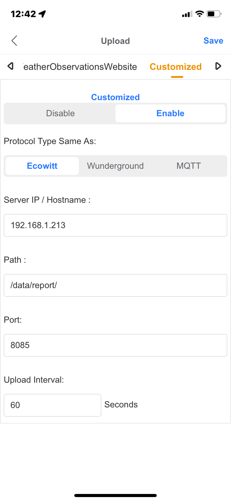
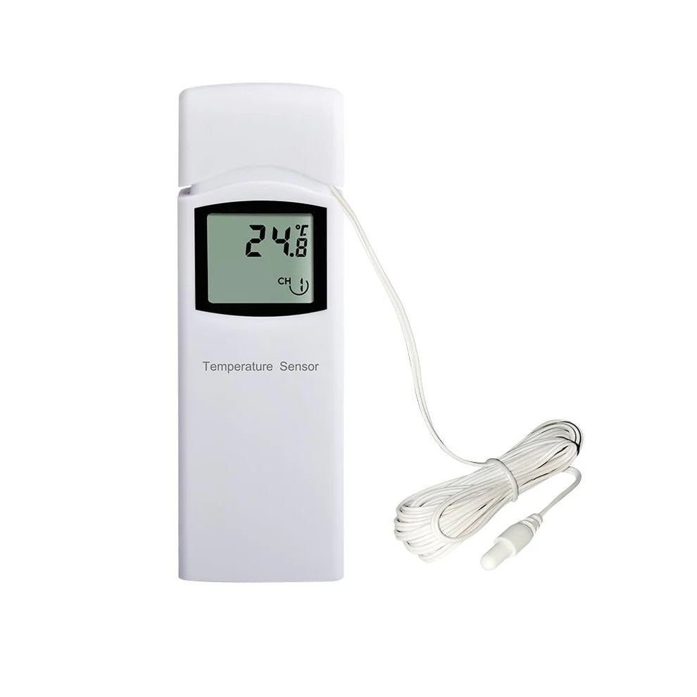
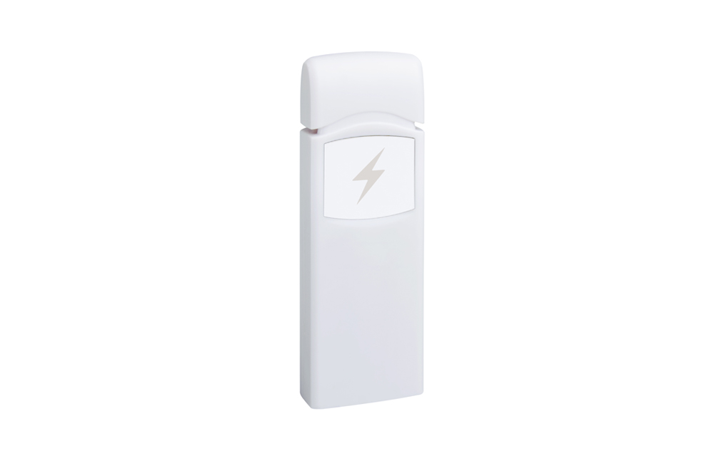

<span align="center" style="text-align:center">
<div align="center" style="text-align:center">


# Homebridge Ecowitt Weather Sensors

<!-- badges -->

[](https://github.com/homebridge/homebridge/wiki/Verified-Plugins) [](https://github.com/rhockenbury/homebridge-ecowitt-weather-sensors/actions/workflows/build-master.yml) [](https://www.npmjs.com/package/homebridge-ecowitt-weather-sensors) [](https://www.npmjs.com/package/homebridge-ecowitt-weather-sensors) [](https://opensource.org/license/apache-2-0)

:fast\_forward: :fast\_forward: :fast\_forward: **[Getting Started](https://github.com/rhockenbury/homebridge-ecowitt-weather-sensors/tree/master?tab=readme-ov-file#getting-started) | [Supported Devices](https://github.com/rhockenbury/homebridge-ecowitt-weather-sensors/tree/master?tab=readme-ov-file#supported-devices) | [Configuration](https://github.com/rhockenbury/homebridge-ecowitt-weather-sensors?tab=readme-ov-file#configuration) | [FAQs](https://github.com/rhockenbury/homebridge-ecowitt-weather-sensors?tab=readme-ov-file#frequently-asked-questions) | [Contributing](https://github.com/rhockenbury/homebridge-ecowitt-weather-sensors/blob/master/docs/CONTRIBUTING.md)** :rewind: :rewind: :rewind:

</div>
</span>

## Homebridge support for your Fine Offset weather station (Ecowitt, Ambient, Froggit, GoGen, and more)

This plugin runs a server that can receive data reports from your weather station Wifi Gateway or Display Console. It works with all brands that white-label [Fine Offset](https://www.foshk.com/) products including Ecowitt, Ambient, Froggit, GARNI, GoGen, ELV, Misol, Pantech, and Watson.

## Features

* Support for most Fine Offset weather station products and sensors
* Operates locally (LAN) without the need for any cloud services
* Detection thresholds for most weather sensor devices to drive automations
* Customize units, sensor override names, and whether to show or hide a device

## Requirements

* Wifi Gateway or Display Console such as the Ecowitt GW2000 or the Ambient WS4000 ([supported devices](https://github.com/rhockenbury/homebridge-ecowitt-weather-sensors?tab=readme-ov-file#supported-devices))
* For Ecowitt (and most other white-labels), the **WSView Plus** app ([iOS](https://apps.apple.com/us/app/wsview-plus/id1581353359) / [Android](https://play.google.com/store/apps/details?id=com.ost.wsautool))
* For Ambient products, the **awnet** app ([iOS](https://apps.apple.com/us/app/awnet/id1341994564) / [Android](https://play.google.com/store/apps/details?id=com.dtston.ambienttoolplus))

> :warning: **This plugin uses a few custom characteristics on HomeKit services which are not visible on the HomeKit app. For full functionality, third-party apps such as [Eve](https://www.evehome.com/en-us/eve-app), [Controller for HomeKit](https://controllerforhomekit.com/) or [Home+](https://apps.apple.com/us/app/home-6/id995994352) are recommended, but not required.**

## Installation

Search for "Ecowitt" on the [Homebridge Config UI X](https://github.com/homebridge/homebridge-config-ui-x) Plugins screen, find `homebridge-ecowitt-weather-sensors` and select to install.

## Getting Started

It is recommended to configure the plugin via the **Settings** UI.

The plugin's **Base Station** settings must be configured before configuring the gateway or display console.

### MAC Address

This can be found on the *About* screen on the Weather Display Console, or via the app (**WSView Plus** or **awnet**). The MAC address is used to validate that the data report was sent from the correct gateway or display console. If the MAC address is not provided, MAC validation will be disabled meaning that the source MAC of each data report will not be checked. MAC address validation can also be optionally disabled in Advanced settings in the plugin UI.

<span align="center" style="text-align:center">
<div align="center" style="text-align:center">

   

*WSView Plus app and awnet app showing MAC Address*

</div>
</span>

### Data Report Service

The **Port** and **Path** settings configure on which port and path the data report service will listen for data reports coming from the gateway or display console.

Default settings are `8080` for the port and `/data/report/` for the path. Other values may be used as desired. Depending on your system or network configuration ensure the **Port** selected is not already in use and is accessible from the base station.

<span align="center" style="text-align:center">
<div align="center" style="text-align:center">


*Plugin UI with Required Configuration Options*

</div>
</span>

### Gateway / Display Console Configuration

After configuring the **Base Station** settings, restart Homebridge and confirm via the status logs that there are no errors and that the data report service has been started and is listening.

Before updating the gateway or display console to report its data to the plugin, ensure all the available devices have been configured and are correctly reporting their data to the base station through the app (**WSView Plus** or **awnet**).

The plugin requires the custom weather service to be configured to report data with **Path** and **Port** parameters that match the same in the **Base Station** settings.

> :warning: **Please double check that the path and port on the custom weather service match the path and port specified on the plugin settings. The plugin will warn you in the logs if it receives a data report on an unexpected path. If there are difficulties with setting the path properly, the accept any path config option in Advanced settings in the plugin UI can be enabled.** :warning:

The service **Protocol Type** must be configured as **Ecowitt** or **Ambient**. The **Upload Interval** can be configured as desired. Anywhere from 20 seconds to 60 seconds is recommended as the data report messages are relatively small and do not put much load on the network or Homebridge host. Keep in mind that the devices transmit data at different rates - anywhere from ~16 seconds to ~80 seconds (depending on the device) so single digit values for the **Upload Interval** may result in the same repeated data being transmitted from the base station to the plugin.

The gateway or display console can be configured using the app (**WSView Plus** or **awnet**). See the screenshots below for the custom weather service upload configuration in each app.

<span align="center" style="text-align:center">
<div align="center" style="text-align:center">

   

*WSView Plus app and awnet app showing Custom Weather Service*

</div>
</span>

It is also recommended to configure the Homebridge host system with a static IP address (or DHCP reservation) to avoid issues with Homebridge IP address changing after system reboots.

After the gateway or display console configuration has been updated, there should be Homebridge status logs indicating accessories are discovered after the first data report is received. Please note that the plugin does not log the data report each time a data report is received, but that behavior can be enabled in Advanced settings in the plugin UI.

## Supported Devices

This plugin currently supports the devices shown in the tables below, *and* any equivalent devices from white-label brands. Any device transmitting data using the Ecowitt protocol or Ambient protocol will likely be supported regardless of whether that specific brand / model is mentioned in the table.

All accessories created by this plugin will use the Ecowitt model numbers so for example the Ambient Weather WH31P will show as an Ecowitt WN30. For help translating model numbers across brands, see [this guide on Fine Offset clones](https://meshka.eu/Ecowitt/dokuwiki/doku.php?id=start#a_brand_model_and_sensor_name_translation_table).

If your gateway, console and/or sensor is currently not supported, [please open a feature request](https://github.com/rhockenbury/homebridge-ecowitt/issues/new?assignees=\&labels=enhancement\&projects=\&template=feature-request.md\&title=).

### Gateways and Consoles

| Ecowitt | Ambient | Description | Service | Product Image |
| -------- | -------- | ------- | ------- | ------ |
| GW1000 / GW1100 | --- | Wifi Weather Station Gateway | <ul><li>Indoor Temperature</li><li>Indoor Humidity</li></ul> |  |
| GW1200 | --- | Wifi Weather Station Gateway | <ul><li>Indoor Temperature</li><li>Indoor Humidity</li></ul> |  |
| GW2000 | --- | Wifi Weather Station Gateway | <ul><li>Indoor Temperature</li><li>Indoor Humidity</li></ul> |  |
| GW3000 | --- | Wifi Weather Station Gateway | <ul><li>Indoor Temperature</li><li>Indoor Humidity</li></ul> |  |
| HP2550 (and variants) | WS2000 / WS4000 / WS5000 | 7" TFT Color Display Console | *use WN32P for indoor temperature and humidity* |  |
| HP2560 / HP2561 / HP2564 | --- | 7" TFT Color Display Console with Indoor Sensor Antenna | <ul><li>Indoor Temperature</li><li>Indoor Humidity</li></ul> |  |
| HP3500 (and variants) | WS3000 | 4.3" TFT Color Display Console | *use WN32P for indoor temperature and humidity* |  |
| WS2320 / WS2350 | --- | 7" LCD Display | <ul><li>Indoor Temperature</li><li>Indoor Humidity</li></ul> |  |
| WS2900 / WS2910 | WS2902 | 6.8" Color LCD Display with Touch Buttons | <ul><li>Indoor Temperature</li><li>Indoor Humidity</li></ul> |  |
| WS3800 / WS3820 | --- | 7.5" LCD Display with IOT Intelligent Linkage Control | <ul><li>Indoor Temperature</li><li>Indoor Humidity</li></ul> |  |
| WS3900 / WS3910 | --- | 7.5" LCD Display with IOT Intelligent Linkage Control | <ul><li>Indoor Temperature</li><li>Indoor Humidity</li></ul> <br> *indoor carbon dioxide not supported* |  |
| WN1820 / WN1821 | --- | 4.9" LCD Display | <ul><li>Indoor Temperature</li><li>Indoor Humidity</li></ul> <br> *indoor carbon dioxide not supported* |  |
| WN1900 / WN1910 / WN1920 | WS1965 | 4.9" LCD Display | <ul><li>Indoor Temperature</li><li>Indoor Humidity</li></ul> |  |
| WN1980 | --- | 5.3" LCD Display with Touch Screen Keys | <ul><li>Indoor Temperature</li><li>Indoor Humidity</li></ul> |  |

### Sensors

| Ecowitt | Ambient | Description | Service | Product Image |
| -------- | -------- | ------- | ------- | ------ |
| LDS01 | --- | Laser Distance Sensor | <ul><li>Air Gap</li><li>Current Depth</li><li>Total Depth</li><li>Battery</li></ul> |  |
| WH25 | --- | Indoor Temperature, Humidity and Barometric Sensor | <ul><li>Indoor Temperature</li><li>Indoor Humidity</li><li>Battery</li></ul> |  |
| WH26 | --- | Outdoor Temperature and Humidity Sensor | <ul><li>Temperature</li><li>Humidity</li><li>Battery</li></ul> |  |
| WN30 | WH31P | Thermometer with Probe | <ul><li>Temperature</li><li>Battery</li></ul> |  |
| WN31 / WH31 (including S and EP variants) | WH31E / WH32M / WH51RF | Multi-Channel Temperature and Humidity Sensor | <ul><li>Temperature</li><li>Humidity</li><li>Battery</li></ul> |  |
| WN32 / WH32 (including EP variant) | --- | Outdoor Temperature and Humidity Sensor <br><br> *Note this will register as a WH26* | <ul><li>Temperature</li><li>Humidity</li><li>Battery</li></ul> |  |
| WN32P | WH32B  | Indoor Temperature, Humidity and Barometric Sensor <br><br> *Note this will register as a WH25* | <ul><li>Indoor Temperature</li><li>Indoor Humidity</li><li>Battery</li></ul> |  |
| WN34 (S, D, and L variants) | --- | Multi-Channel Temperature Sensor | <ul><li>Temperature</li><li>Battery</li></ul>  |  |
| WN35 | WH51LW | Leaf Wetness Sensor | <ul><li>Leaf Wetness</li><li>Battery</li></ul>  |  |
| WN36 | WH31PF | Floating Pool Thermometer <br><br> *Note this will register as a WN30* | <ul><li>Temperature</li><li>Battery</li></ul> |  |
| WH40 (including H variant) | --- | Self-Emptying Rain Collector Rainfall Sensor | <ul><li>Rain Rate</li><li>Rain Event Total</li><li>Rain Hourly Total</li><li>Rain Daily Total</li><li>Rain Weekly Total</li><li>Rain Monthly Total</li><li>Rain Yearly Total</li><li>Battery</li></ul> |  |
| WH41 | PM25 | PM2.5 Air Quality Sensor with Solar Panel | <ul><li>PM2.5 Air Quality</li><li>PM2.5 Air Quality (24hrs)</li><li>Battery</li></ul> |  |
| WH43 | PM25IN | PM2.5 Air Quality Sensor <br><br> *Note this will register as a WH41* | <ul><li>PM2.5 Air Quality</li><li>PM2.5 Air Quality (24hrs)</li><li>Battery</li></ul> |  |
| WH45 | AQIN | 5-in-1 PM2.5 / PM10 / CO₂ Air Quality Sensor | <ul><li>Temperature</li><li>Humidity</li><li>PM2.5 Air Quality</li><li>PM2.5 Air Quality (24hrs)</li><li>PM10 Air Quality</li><li>PM10 Air Quality (24hrs)</li><li>CO₂ Level</li><li>CO₂ Level (24 hrs)</li><li>Battery</li></ul> |  |
| WH46 (including D variant) | --- | 7-in-1 PM1.0 / PM2.5 / PM4.0 / PM10 / CO₂ Air Quality Sensor | <ul><li>Temperature</li><li>Humidity</li><li>PM2.5 Air Quality</li><li>PM2.5 Air Quality (24hrs)</li><li>PM10 Air Quality</li><li>PM10 Air Quality (24hrs)</li><li>CO₂ Level</li><li>CO₂ Level (24 hrs)</li><li>Battery</li></ul> |  |
| WH51 (and L variant) | WH31SM | Soil Moisture Sensor | <ul><li>Soil Moisture</li><li>Battery</li></ul> |  |
| WH55 | WH31LA | Water Leak Detection Sensor | <ul><li>Water Leak</li><li>Battery</li></ul> |  |
| WH57 | WH31L | Lightning Detection Sensor | <ul><li>Lightning Events</li><li>Lightning Distance</li><li>Lightning Time</li><li>Battery</li></ul> |  |

### Sensor Arrays

| Ecowitt | Ambient | Description | Service | Product Image |
| -------- | -------- | ------- | ------- | ------ |
| WH65 (Y-shape) / WS69 (I-shape) | WS2000 | Solar Powered 7-in-1 Outdoor Station | <ul><li>Temperature</li><li>Humidity</li><li>Solar Radiation</li><li>UV Index</li><li>Wind Direction</li><li>Wind Speed</li><li>Wind Gust Speed</li><li>Wind Max Daily Speed</li><li>Rain Rate</li><li>Rain Event Total</li><li>Rain Hourly Total</li><li>Rain Daily Total</li><li>Rain Weekly Total</li><li>Rain Monthly Total</li><li>Rain Yearly Total</li><li>Battery</li></ul> |  |
| WN67 | WS1965 | 5-in-1 Outdoor Station | <ul><li>Temperature</li><li>Humidity</li><li>Wind Direction</li><li>Wind Speed</li><li>Wind Gust Speed</li><li>Wind Max Daily Speed</li><li>Rain Rate</li><li>Rain Event Total</li><li>Rain Hourly Total</li><li>Rain Daily Total</li><li>Rain Weekly Total</li><li>Rain Monthly Total</li><li>Rain Yearly Total</li><li>Battery</li></ul> |  |
| WS68 | --- | Solar Powered 4-in-1 Outdoor Station | <ul><li>Solar Radiation</li><li>UV Index</li><li>Wind Direction</li><li>Wind Speed</li><li>Wind Gust Speed</li><li>Wind Max Daily Speed</li><li>Battery</li></ul> |  |
| WS80 | WS5000 | Solar Powered 6-in-1 Outdoor Station | <ul><li>Temperature</li><li>Humidity</li><li>Solar Radiation</li><li>UV Index</li><li>Wind Direction</li><li>Wind Speed</li><li>Wind Gust Speed</li><li>Wind Max Daily Speed</li><li>Battery</li></ul> |  |
| WS85 | --- | 3-in-1 Solar Weather Station | <ul><li>Wind Direction</li><li>Wind Speed</li><li>Wind Gust Speed</li><li>Wind Max Daily Speed</li><li>Rain Rate</li><li>Rain Event Total</li><li>Rain Hourly Total</li><li>Rain Daily Total</li><li>Rain Weekly Total</li><li>Rain Monthly Total</li><li>Rain Yearly Total</li><li>Battery</li></ul> |  |
| WS90 | WS4000 | Solar Powered 7-in-1 Outdoor Anti-vibration Haptic Sensor Array | <ul><li>Temperature</li><li>Humidity</li><li>Solar Radiation</li><li>UV Index</li><li>Wind Direction</li><li>Wind Speed</li><li>Wind Gust Speed</li><li>Wind Max Daily Speed</li><li>Rain Rate</li><li>Rain Event Total</li><li>Rain Hourly Total</li><li>Rain Daily Total</li><li>Rain Weekly Total</li><li>Rain Monthly Total</li><li>Rain Yearly Total</li><li>Battery</li></ul> |  |

> :warning: **This plugin does not currently implement barometric (pressure) services and PM1.0/PM4.0 air quality services.  While these are not supported natively by HomeKit as this time, they are planned to be implemented with custom services/characteristics, see [this issue](https://github.com/rhockenbury/homebridge-ecowitt-weather-sensors/issues/5).**

## Configuration

### Basic Configuration

This plugin will work with the basic configuration described in [Getting Started](https://github.com/rhockenbury/homebridge-ecowitt-weather-sensors/tree/master?tab=readme-ov-file#getting-started). Note that `port` defaults to `8080` and `path` defaults to `/data/report/`.  The MAC is only required if you would like MAC address validation on each received data report.  As an example -

```
{
    "platform": "Ecowitt",
    "baseStation": {
        "mac": "30:C9:22:3E:DD:2B",
        "port": 8080,
        "path": "/data/report/"
    }
}
```

### All Configuration

It's recommended to configure the plugin through the Plugin Config UI on the Homebridge UI. [Checkout the configs folder](https://github.com/rhockenbury/homebridge-ecowitt-weather-sensors/tree/master/tests/configs) for examples if you are configuring through JSON directly.

| Option | Default | Explanation |
| -------- | ------- | ------- |
| baseStation.mac | `00:00:00:00:00:00` | The MAC address of the gateway or console. If not set or if invalid, the default is used *and* MAC validation (`additional.macValidation`) will be disabled |
| baseStation.port | `8080` | The port on which to listen for data reports from the gateway or console |
| baseStation.path | `/data/report/` | The URL path on which to listen for data reports from the gateway or console |
| units.wind | `mph` | The units to display wind speed. Possible values are: <br/><br/>`mph`: Miles per Hour<br/>`kph`: Kilometers per Hour<br/>`mps`: Meters per Second<br/>`kts`: Knots |
| units.rain | `in` | The units to display rain accumulation. Possible values are: <br/><br/>`in`: Inches<br/>`mm`: Millimeters</p> |
| units.temperature | `fh` | The units to display temperature. Possible values are: <br/><br/>`fh`: Fahrenheit<br/>`ce`: Celcius |
| units.lightningDistance | `mi` | The units to display distance for the lightning sensor data properties such as lightning strike distance.  Possible values are: <br/><br/>`mi`: Miles<br/>`km`: Kilometers |
| units.laserDistance | `in` | The units to display distance for the laser distance sensor such as the air gap distance.  Possible values are: <br/><br/>`in`: Inches<br/>`ft`: Feet<br/>`mm`: Millimeters<br/>`mt`: Meters |
| thresholds | `{}` | A mapping of a data property to the trigger threshold for that property.  By default no thresholds are set. Trigger thresholds should be specified in the units selected under the `units` configuration block. Possible keys are: <br/><br/>`windSpeed`<br/>`windGustSpeed`<br/>`windMaxDailySpeed`<br/>`rainRate`<br/>`rainEventTotal`<br/>`rainHourlyTotal`<br/>`rainDailyTotal`<br/>`rainWeeklyTotal`<br/>`rainMonthlyTotal`<br/>`rainYearlyTotal`<br/>`uvIndex`<br/>`lightningEvents`<br/>`lightningDistance *`<br/>`lightningTime *` <br/><br/> \*The value of the data property must be <strong>greater than</strong> the threshold to trigger the accessory (motion detected), except for `lightningDistance` and `lightningTime` which are triggered when the data property is <strong>less than</strong> the threshold. |
| hidden | `{}` | A mapping of a data property or device to whether it should be displayed. By default no data properties or devices are hidden. Either a data property is hidden across all devices, or the device with all its data properties is hidden. See `customHidden` if more granularity is needed. <br/><br/> Possible keys to hide data are: <br/><br/>`windDirection`<br>`windSpeed`<br/>`windGustSpeed`<br/>`windMaxDailySpeed`<br/>`rainRate`<br/>`rainEventTotal`<br/>`rainHourlyTotal`<br/>`rainDailyTotal`<br/>`rainWeeklyTotal`<br/>`rainMonthlyTotal`<br/>`rainYearlyTotal`<br/>`solarRadiation`<br/>`uvIndex`<br/>`temperature`<br/>`humidity`<br/>`indoorTemperature`<br/>`indoorhumidity`<br/>`soilMoisture`<br/>`leafWetness`<br/>`waterLeak`<br/>`airQualityPM25`<br/>`airQualityPM25Avg`<br/>`airQualityPM10`<br/>`airQualityPM10Avg`<br/>`carbonDioxide`<br/>`carbonDioxideAvg`<br/>`lightningEvents`<br/>`lightningDistance`<br/>`lightningTime`<br/>`airGap`<br/>`currentDepth`<br/>`totalDepth`<br/>`battery` <br/><br/> Possible keys to hide devices are: <br/><br>`BASE` (For gateway or console)<br>`LDS01`<br>`WH25` (Also use for `WN32P`)<br>`WH26` (Also use for `WN32`)<br>`WN30` (Also use for `WN36`)<br>`WN31`<br>`WN34`<br>`WN35`<br>`WH40`<br>`WH41` (Also use for `WH43`)<br>`WH45`<br>`WH46`<br>`WH51`<br>`WH55`<br>`WH57`<br>`WH65` (Also use for `WS69`)<br>`WN67`<br>`WS68`<br>`WS80`<br>`WS85`<br/>`WS90`<br><br> These product numbers correspond to the Ecowitt device numbers so if you are using a non-Ecowitt device please translate your model to the equivalent Ecowitt device. <br><br> Please note that if all data properties for a device are hidden, the device itself will be hidden automatically.|
| customHidden | `[]` | A list of service identifies that specifies a specific service on a specific device should not be displayed. This provides additional customization beyond `hidden` by allowing any service on any device to be hidden.  <br><br> The service identifier is specified in the form `YYYY(CHZ):<data-property>`. <br><br>`YYYY` is the device id (e.g. WH41) <br> `(CHZ)` is the optional channel id if the device uses a channel. <br><br> The data property can be set to any of the data keys indicated in `hidden`. [See here for additional help with custom hidden properties](https://github.com/rhockenbury/homebridge-ecowitt-weather-sensors/wiki/Setting-Custom-Hidden-Properties). |
| nameOverrides | `[]` | A list of key value pairs that specifies the override name for an accessory service.  Each override takes on the form: <br><br> `{"key": "<the-service-identifier>", "value", "<the-override-name>"}` <br><br> The service identifier is specified in the form `YYYY(CHZ):<data-property>`. <br><br>`YYYY` is the device id (e.g. WH41) <br> `(CHZ)` is the optional channel id if the device uses a channel. <br><br> The data property can be set to any of the data keys indicated in `hidden`. [See here for additional help with name overrides](https://github.com/rhockenbury/homebridge-ecowitt-weather-sensors/wiki/Setting-Name-Overrides). |
| additional.staticNames | `false` | Set to `true` to not show the data property value in the service names of the accessory so that the service names do not change. |
| additional.validateMac | `true` | Check that the MAC address in each data report matches the MAC address specified for the plugin, and do not process the data report if it does not match. |
| additional.luxFactor | `126.7` | Factor to multiple the Solar Radiation data (in W/m<sup>2</sup>) to convert to Lux. |
| additional.acceptAnyPath | `false` | Process data reports that are submitted to the plugin on paths other than the path specified in `baseStation.path`. |
| additional.validateTimestamp | `true` | Check the recency of the data report with the `dateutc` data property, and do not process the data report if its determined to be old. |
| additional.removeStaleDevices | `true` | Remove the accessory from Homebridge if it does not appear in the current data report during device discovery. |
| additional.logDataReports | `false` | Show the full data report in Homebridge logs every time a data report is received. If not enabled, the data report is also shown in the logs [when Homebridge is in debug mode](https://github.com/rhockenbury/homebridge-ecowitt-weather-sensors/wiki/Submitting-Data-Report#step-1-set-homebridge-to-debug-mode). |

## Frequently Asked Questions

### How do I migrate to this plugin from other Homebridge Ecowitt plugins?

> This plugin includes most prior version of Homebridge Ecowitt plugin forks including v1.0 and v1.1 from [spatialdude](https://github.com/spatialdude), v1.2 and v1.3 from [ochong](https://github.com/ochong) and v1.4 from [pavelserbajlo](https://github.com/pavelserbajlo). If you are currently using any of these mentioned versions, you can switch to the same version of <em>this</em> plugin and get the same functionality.

> I would also recommend updating to the latest version of this plugin to take advantage of the new features. Check out the [v2 migration guide](https://github.com/rhockenbury/homebridge-ecowitt-weather-sensors/wiki/V2-Migration-Guide) for more info on updating.

### Does this plugin support devices produced by other manufacturers?

> There are a number of weather station distributors that re-brand the hardware sensors from [Fine Offset](https://www.foshk.com/Wifi_Weather_Station/). Along with Ecowitt, other notable distributors include Ambient Weather and Froggit.  These brands typically also use similar firmware / software within their ecosystem, and many provide the ability to publish weather data reports to a custom endpoint.

> If the weather station equipment you are using supports a custom weather service endpoint using the Ecowitt protocol or Ambient protocol, then this plugin can support it regardless of the labeled distributor. For any issues, please [file a Github issue](https://github.com/rhockenbury/homebridge-ecowitt-weather-sensors/issues/new/choose), and make sure to [include the data report](https://github.com/rhockenbury/homebridge-ecowitt-weather-sensors/wiki/Submitting-Data-Report).

### I've added a device to my gateway or console, and can see it on the app (**WSView Plus** or **awnet**), but the accessory is not showing up in Homebridge or Homekit?

> The plugin only performs device discovery on the first data report after the plugin starts. If you add a device, please restart Homebridge to trigger the discovery and the plugin should pick up the new device, and create the accessory. In the Homebridge logs, you can look for logs that begin with `Adding new accessory` to confirm it was added.

### I use a sensor that's not currently supported.  What can I do to get it supported?

> Please [open a feature request](https://github.com/rhockenbury/homebridge-ecowitt/issues/new?assignees=\&labels=enhancement\&projects=\&template=feature-request.md\&title=) on the Github project to let me know what devices you are interested in getting support for. Please make sure to [include the data report](https://github.com/rhockenbury/homebridge-ecowitt-weather-sensors/wiki/Submitting-Data-Report) in the feature request.

### I'm having difficulties with setting the name overrides for a data property.  Can you help?

> Yes, this is definitely a bit tricky, and might require a bit of trial of error.  I would suggest first looking at the [Name Overrides Guide](https://github.com/rhockenbury/homebridge-ecowitt-weather-sensors/wiki/Setting-Name-Overrides) and see if that is able to help for your case.  And of course, if you need additional help with setting name overrides, please file a [Githbub issue](https://github.com/rhockenbury/homebridge-ecowitt-weather-sensors/issues/new?template=support-request.md).

## Contributing

Contributions are welcomed! Please report bugs, suggest improvements, and open pull requests. For major pull requests, please open an issue first to discuss what you would like to change. See the [Contributing Guide](./docs/CONTRIBUTING.md) for more info.

The project is also looking for [your input on these issues](https://github.com/rhockenbury/homebridge-ecowitt-weather-sensors/issues?q=is%3Aissue%20state%3Aopen%20label%3Aseeking-input).

## Supporting

This plugin requires my time and energy to develop and maintain, as well as the occasional purchase of sensor arrays and gateways. If you feel you have gotten value from this plugin, please consider [making a donation](https://www.paypal.com/donate/?business=4G6G3V4CYG2CY). Github Stars are appreciated too!

<span align="center" style="text-align:center">
<div align="center" style="text-align:center">

:fast\_forward: :fast\_forward: :fast\_forward: **[Getting Started](https://github.com/rhockenbury/homebridge-ecowitt-weather-sensors/tree/master?tab=readme-ov-file#getting-started) | [Supported Devices](https://github.com/rhockenbury/homebridge-ecowitt-weather-sensors/tree/master?tab=readme-ov-file#supported-devices) | [Configuration](https://github.com/rhockenbury/homebridge-ecowitt-weather-sensors?tab=readme-ov-file#configuration) | [FAQs](https://github.com/rhockenbury/homebridge-ecowitt-weather-sensors?tab=readme-ov-file#frequently-asked-questions) | [Contributing](https://github.com/rhockenbury/homebridge-ecowitt-weather-sensors/blob/master/docs/CONTRIBUTING.md)** :rewind: :rewind: :rewind:

</div>
</span>
